# Part 1 — Universal Directory

**Okta's Cloud-Native Directory Service**

Configure Okta's Universal Directory with custom profile attributes, organizational users, and role-based groups with automated membership rules.

---

## Objective

Establish the foundational identity infrastructure in Okta by configuring the Universal Directory with custom user attributes, creating organizational users, and implementing both manual and rule-based group assignments.

---

## Technologies Used

| Component | Purpose |
|-----------|---------|
| **Okta Universal Directory** | Cloud-native identity store |
| **Profile Editor** | Custom attribute schema management |
| **Group Rules Engine** | Automated group membership assignment |
| **Admin Console** | Centralized management interface |

---

## Configuration Steps

### 1.1: Accessing the Admin Console

Navigate to the Okta Admin Console to begin directory configuration. The dashboard provides an overview of your organization's identity status including users, groups, and SSO applications.

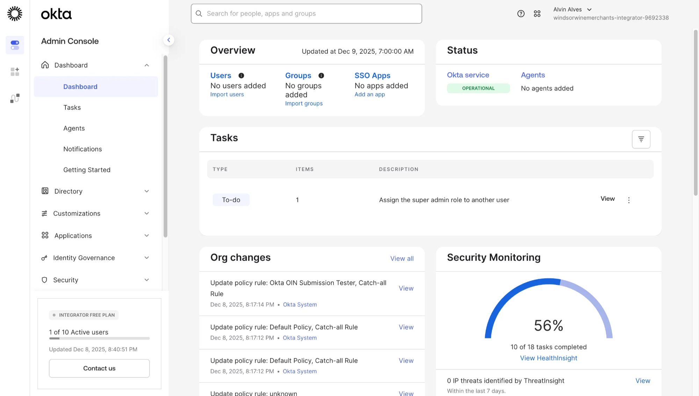

**Key Dashboard Elements:**
- **Overview** — Current user and group counts
- **Status** — Okta service health (Operational)
- **Tasks** — Pending administrative actions
- **Security Monitoring** — ThreatInsight and health score

---

### 1.2: Configuring Custom Profile Attributes

Before creating users, extend the default Okta user profile with custom attributes to support organizational classification and automated group assignment.

Navigate to **Directory → Profile Editor** and select the **User** profile to add custom attributes.

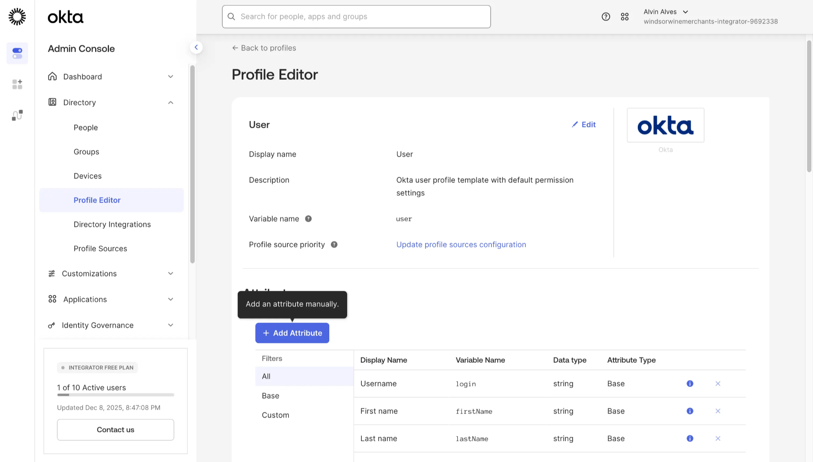

#### Creating the User Type Attribute

Add a custom attribute to classify users as Employees or Contractors. This attribute will be used for automated group rule assignment.

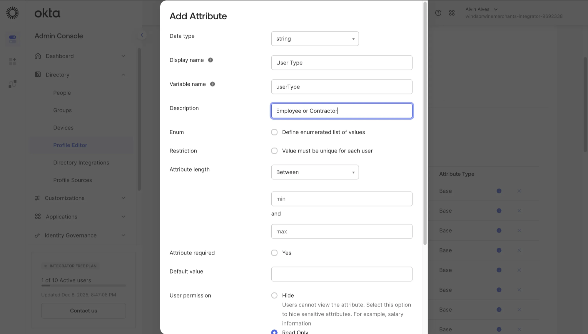

| Field | Value |
|-------|-------|
| Data type | string |
| Display name | User Type |
| Variable name | userType |
| Description | Employee or Contractor |

#### Creating the Department Attribute

Add a Department attribute to organize users by functional area within the organization.

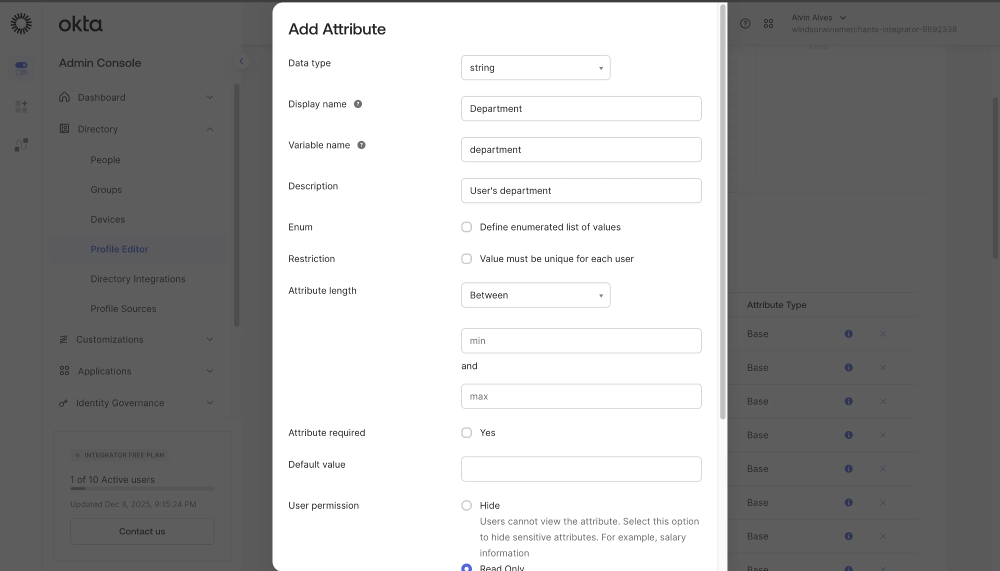

| Field | Value |
|-------|-------|
| Data type | string |
| Display name | Department |
| Variable name | department |
| Description | User's department |

---

### 1.3: Creating Organizational Users

With custom attributes configured, create users representing the ZeroTrustSociety organization. Each user is assigned appropriate profile attributes.

Navigate to **Directory → People** and click **Add Person** to create each user.

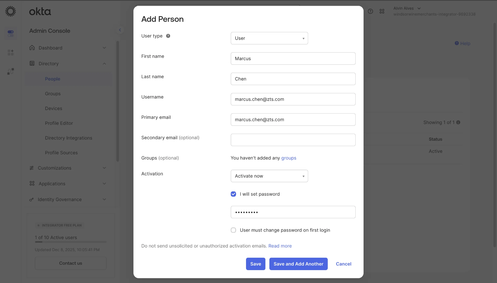

| Field | Value |
|-------|-------|
| User type | User |
| First name | Marcus |
| Last name | Chen |
| Username | marcus.chen@zts.com |
| Primary email | marcus.chen@zts.com |
| Activation | Activate now |
| Password | Set initial password with "I will set password" option |

#### User Directory Populated

After creating all organizational users, the People directory displays the complete user roster.

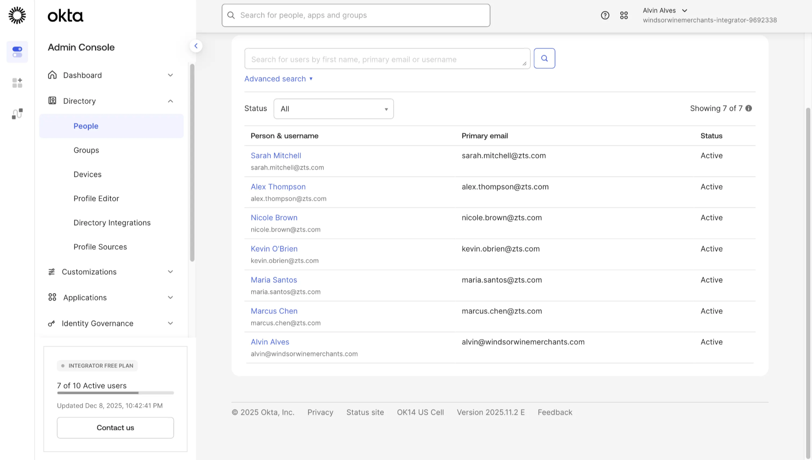

| Name | Email | Status |
|------|-------|--------|
| Sarah Mitchell | sarah.mitchell@zts.com | Active |
| Alex Thompson | alex.thompson@zts.com | Active |
| Nicole Brown | nicole.brown@zts.com | Active |
| Kevin O'Brien | kevin.obrien@zts.com | Active |
| Maria Santos | maria.santos@zts.com | Active |
| Marcus Chen | marcus.chen@zts.com | Active |
| Alvin Alves | alvin@windsorwinemerchants.com | Active |

#### Viewing User Profile Attributes

Each user's profile displays the custom attributes configured in the Profile Editor.

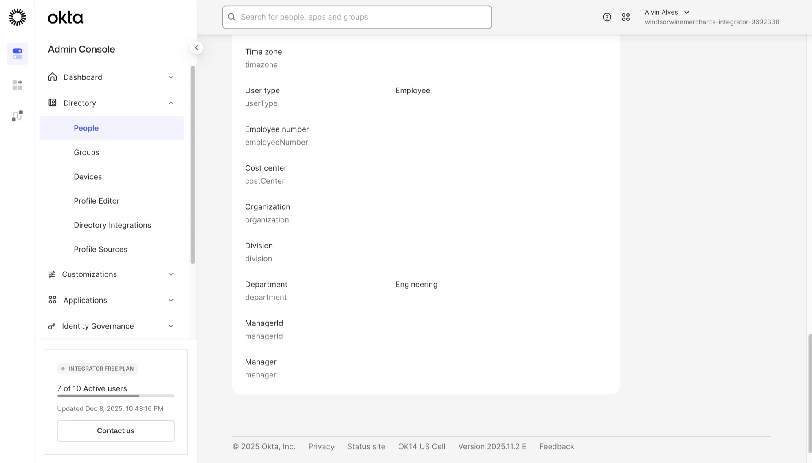

**Profile Attributes Displayed:**
- **User type:** Employee
- **Department:** Engineering
- **Employee number, Cost center, Organization, Division, Manager** — Available for future configuration

---

### 1.4: Creating Organizational Groups

Create groups to organize users by role and function. Groups enable collective access control and policy assignment.

Navigate to **Directory → Groups** and click **Add Group**.

#### Creating the ZTS-Admins Group

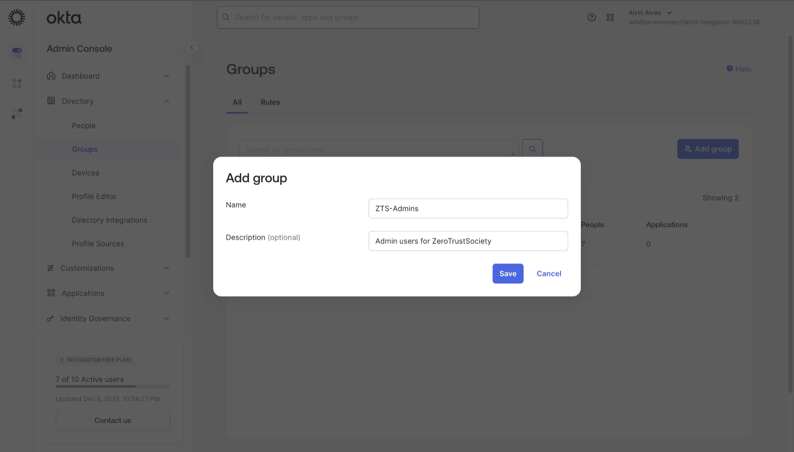

| Field | Value |
|-------|-------|
| Name | ZTS-Admins |
| Description | Admin users for ZeroTrustSociety |

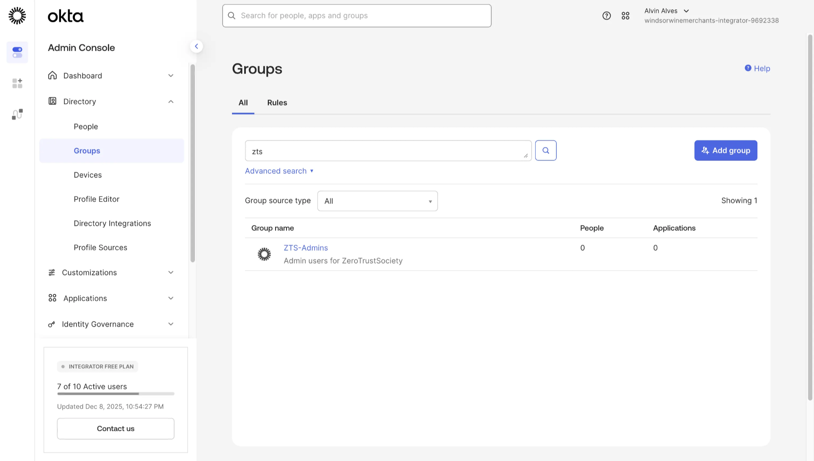

#### Creating the ZTS-Executives Group

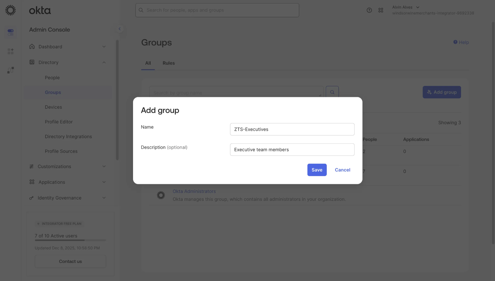

| Field | Value |
|-------|-------|
| Name | ZTS-Executives |
| Description | Executive team members |

#### Creating the ZTS-All-Employees Group

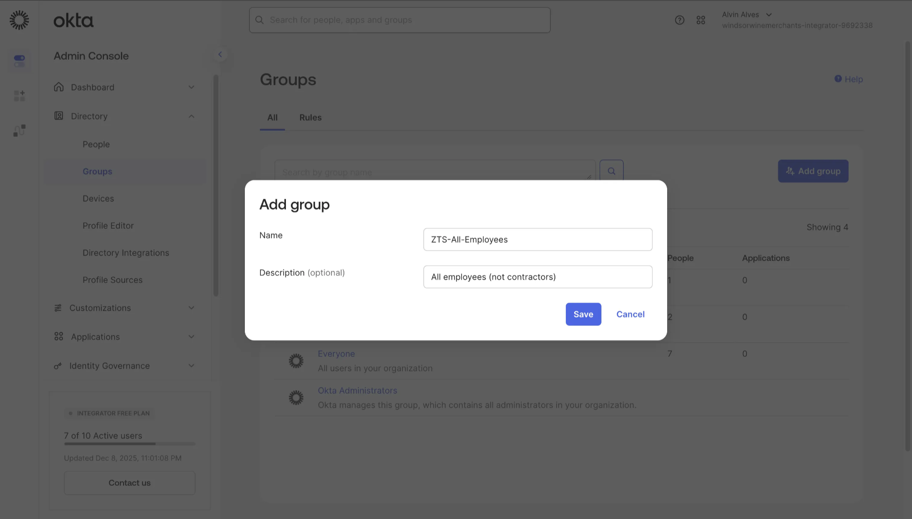

| Field | Value |
|-------|-------|
| Name | ZTS-All-Employees |
| Description | All employees (not contractors) |

---

### 1.5: Assigning Users to Groups

Manually assign users to appropriate groups based on their organizational role.

#### Assigning Admins

Navigate to the ZTS-Admins group and assign administrative users.

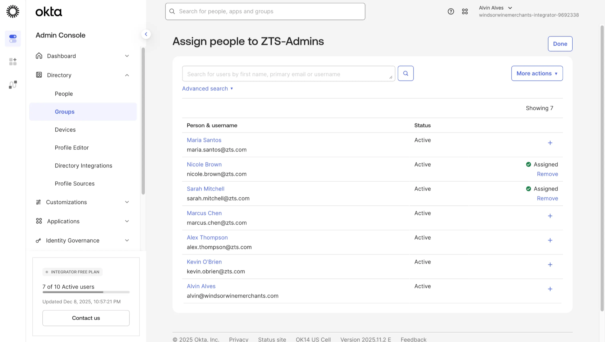

**Assigned Members:**
- Nicole Brown ✓ Assigned
- Sarah Mitchell ✓ Assigned

#### Assigning Executives

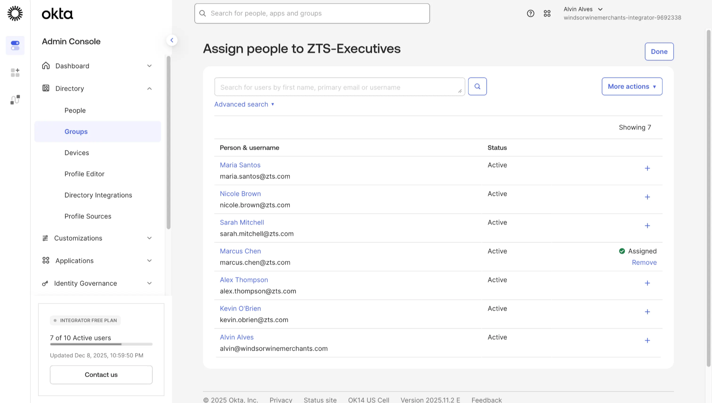

**Assigned Members:**
- Marcus Chen ✓ Assigned

#### Groups Before Rule Activation

After manual group creation, some groups remain empty pending automated rule assignment.

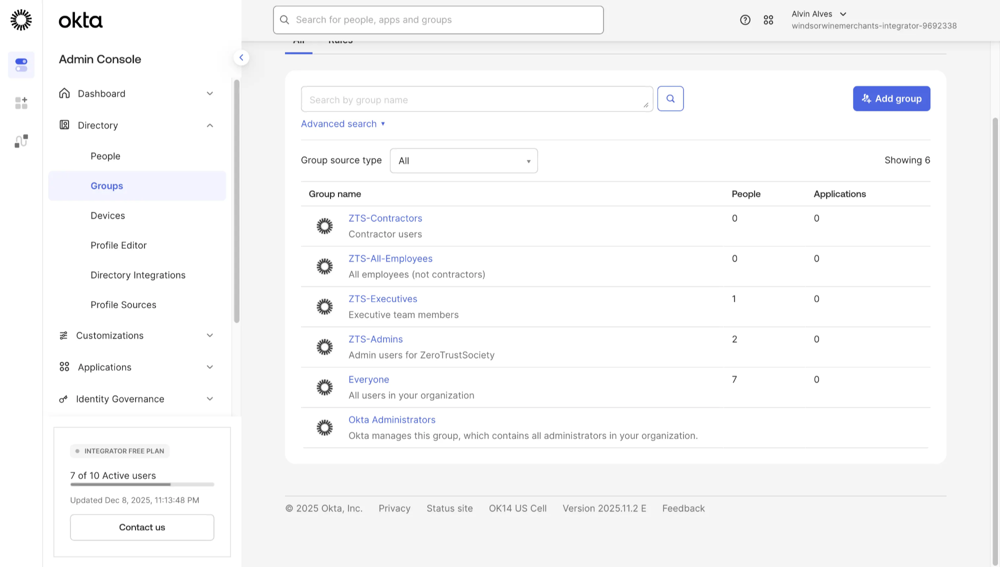

---

### 1.6: Creating Group Rules

Implement automated group membership using Okta's Group Rules engine. Rules dynamically assign users to groups based on profile attributes.

Navigate to **Directory → Groups → Rules** tab and click **Add Rule**.

#### ZTS-All-Employees Rule

Create a rule to automatically assign all employees (not contractors) to the ZTS-All-Employees group.

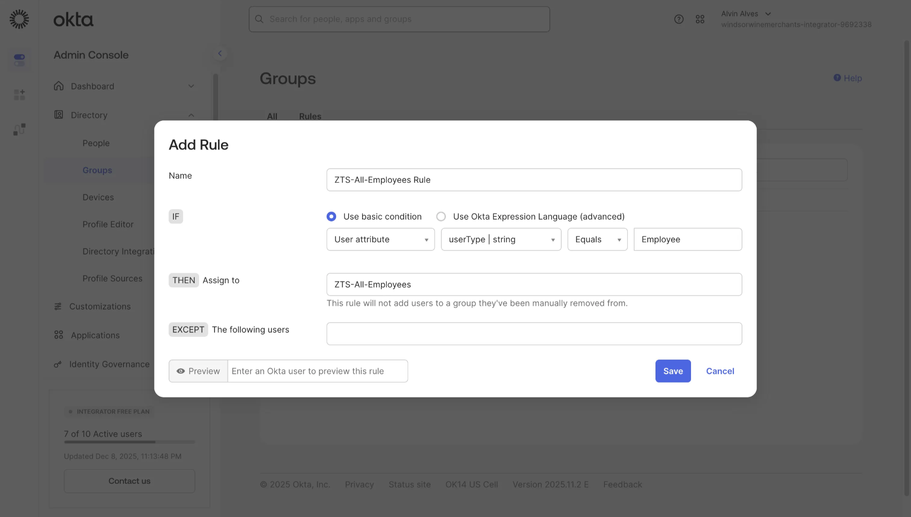

| Component | Value |
|-----------|-------|
| **Name** | ZTS-All-Employees Rule |
| **IF** | User attribute: userType \| string **Equals** Employee |
| **THEN Assign to** | ZTS-All-Employees |
| **EXCEPT** | (none) |

**Rule Logic:** `IF userType = "Employee" → THEN add to ZTS-All-Employees group`

#### Rules Created (Inactive State)

After creating all group rules, they appear in the Rules tab in an Inactive state awaiting activation.

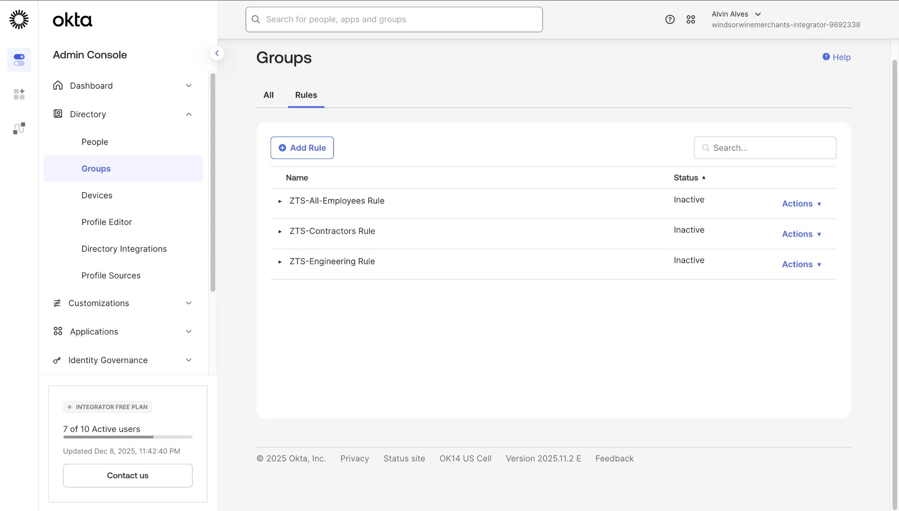

| Rule Name | Status |
|-----------|--------|
| ZTS-All-Employees Rule | Inactive |
| ZTS-Contractors Rule | Inactive |
| ZTS-Engineering Rule | Inactive |

---

### 1.7: Activating Group Rules

Activate the group rules to enable automated membership assignment.

| Rule Name | Status |
|-----------|--------|
| ZTS-All-Employees Rule | ✅ Active |
| ZTS-Contractors Rule | ✅ Active |
| ZTS-Engineering Rule | ✅ Active |

---

### 1.8: Final Group Structure

With rules activated, groups are automatically populated based on user profile attributes.

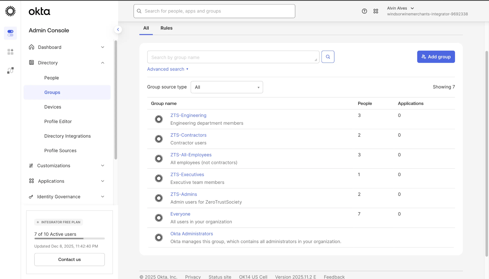

| Group Name | Description | Members | Applications |
|------------|-------------|---------|--------------|
| ZTS-Engineering | Engineering department members | 3 | 0 |
| ZTS-Contractors | Contractor users | 2 | 0 |
| ZTS-All-Employees | All employees (not contractors) | 3 | 0 |
| ZTS-Executives | Executive team members | 1 | 0 |
| ZTS-Admins | Admin users for ZeroTrustSociety | 2 | 0 |
| Everyone | All users in your organization | 7 | 0 |
| Okta Administrators | System-managed admin group | — | — |

---

## Outcome

Successfully configured Okta Universal Directory with:

- **Custom Profile Schema** — Extended user profile with userType and Department attributes
- **Organizational Users** — 7 active users with complete profile information
- **Role-Based Groups** — 5 custom groups organized by function and department
- **Automated Membership** — 3 group rules dynamically assigning users based on attributes
- **Manual Assignments** — Executive and Admin groups with specific member assignments

---

## Key Takeaways

**Skills Demonstrated:**
- Okta Universal Directory configuration and management
- Custom profile attribute schema design
- User provisioning with organizational attributes
- Group creation and membership assignment
- Group Rules engine for automated access control
- Attribute-based group membership (foundation for ABAC)

**Enterprise Relevance:**
- Establishes scalable identity foundation for SSO and access policies
- Enables automated user onboarding through attribute-based rules
- Supports compliance through organized group structure
- Provides basis for application provisioning in Part 2

---

← [Back to Lab Overview](../README.md) | [Part 2: Application Integration & SSO →](part-2-application-integration-sso.md)
