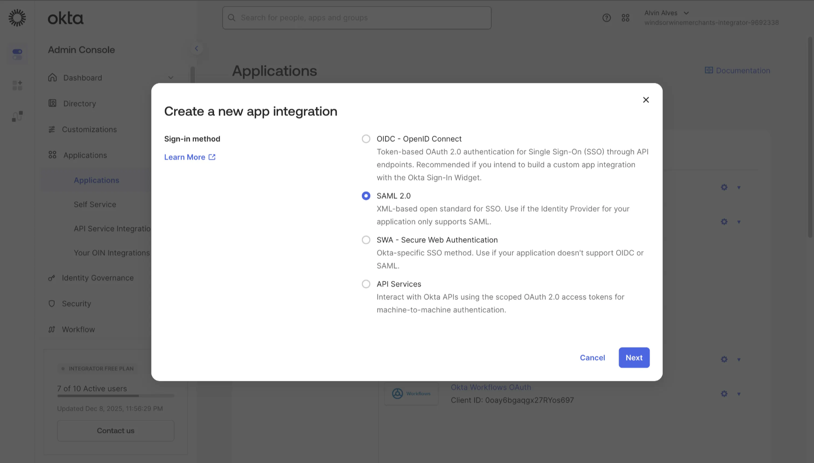
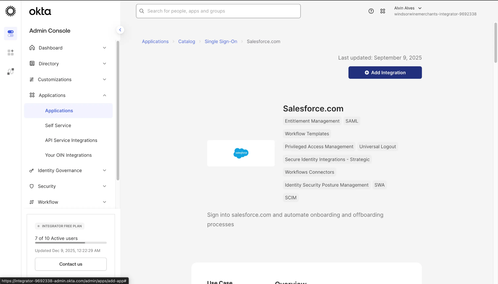
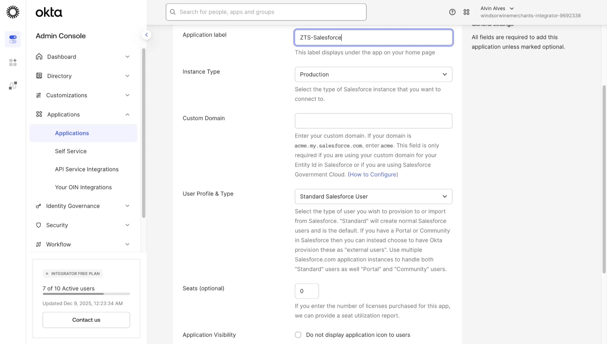
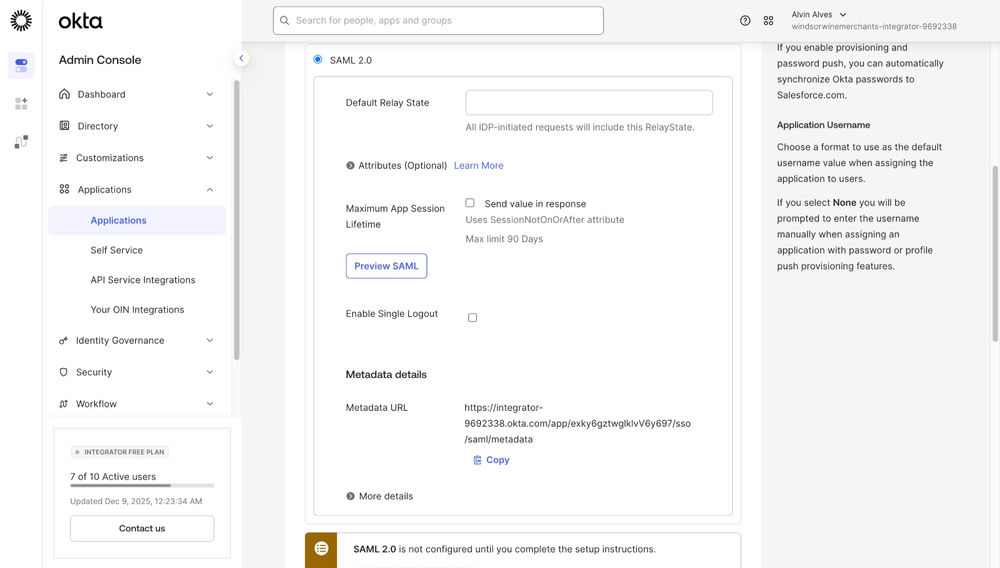
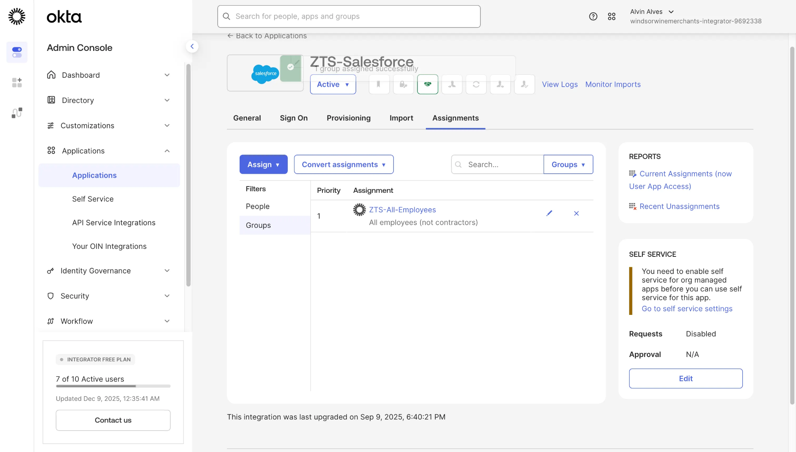
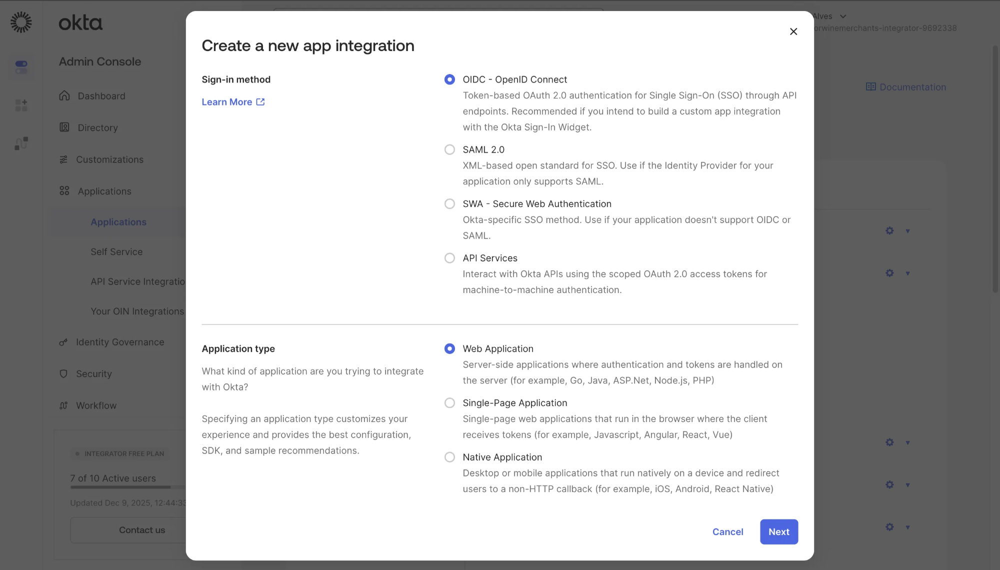
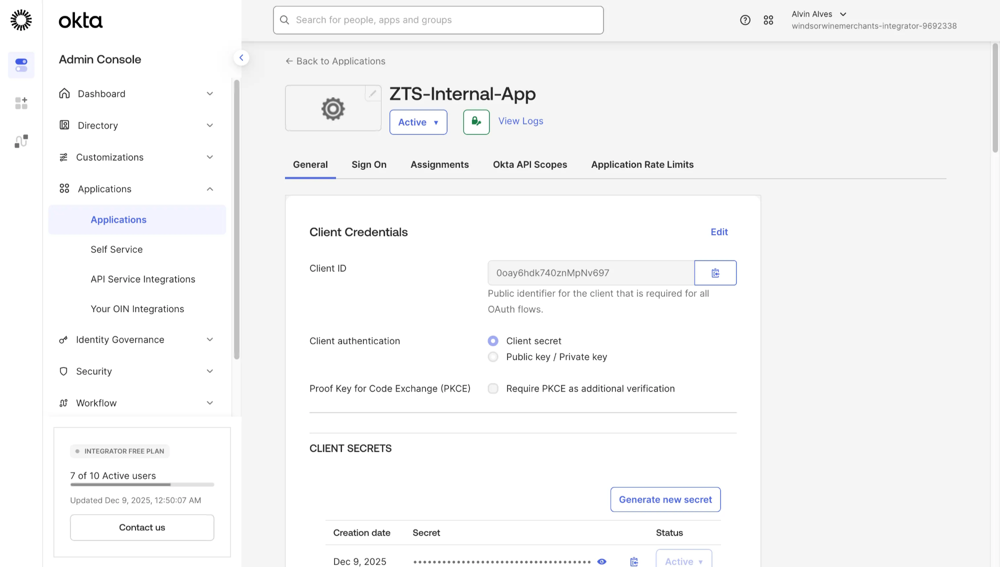

# Part 2 — Application Integration & SSO

**Federated Single Sign-On with SAML 2.0 and OpenID Connect**

Integrate enterprise applications using industry-standard federation protocols, demonstrating both pre-built OIN catalog integrations and custom OIDC application configurations.

---

## Objective

Configure federated single sign-on for enterprise applications using both SAML 2.0 (for SaaS applications like Salesforce) and OpenID Connect (for custom web applications), establishing centralized authentication through Okta as the Identity Provider.

---

## Technologies Used

| Component | Purpose |
|-----------|---------|
| **SAML 2.0** | XML-based federation protocol for enterprise SSO |
| **OpenID Connect (OIDC)** | OAuth 2.0-based authentication for modern applications |
| **Okta Integration Network (OIN)** | Pre-built application catalog with 7,000+ integrations |
| **OAuth 2.0** | Authorization framework for API access |

---

## Configuration Steps

### 2.1: Understanding SSO Protocol Options

Before integrating applications, understand the available authentication protocols in Okta.

Navigate to **Applications → Applications** and click **Create App Integration** to view the available sign-in methods.



**Available Sign-In Methods:**

| Protocol | Use Case |
|----------|----------|
| **OIDC - OpenID Connect** | Token-based OAuth 2.0 authentication for custom apps and APIs |
| **SAML 2.0** | XML-based standard for enterprise SaaS applications |
| **SWA** | Okta-specific method for apps without SAML/OIDC support |
| **API Services** | Machine-to-machine authentication with scoped tokens |

**Selection:** SAML 2.0 — Selected for Salesforce integration (enterprise SaaS standard)

---

### 2.2: Adding Salesforce from OIN Catalog

Leverage the Okta Integration Network to add pre-configured Salesforce integration with SAML support.

Navigate to **Applications → Browse App Catalog** and search for "Salesforce".



**Salesforce Integration Features:**
- **Entitlement Management** — Role and permission synchronization
- **SAML** — Federated SSO authentication
- **Workflow Templates** — Pre-built automation flows
- **Privileged Access Management** — Enhanced security controls
- **Universal Logout** — Centralized session termination
- **SCIM** — Automated user provisioning
- **Workflows Connectors** — Integration with Okta Workflows

Click **Add Integration** to begin configuration.

---

### 2.3: Configuring Salesforce Application Settings

Configure the Salesforce application instance with organization-specific settings.



| Setting | Value |
|---------|-------|
| **Application label** | ZTS-Salesforce |
| **Instance Type** | Production |
| **Custom Domain** | (Optional - for custom Salesforce domains) |
| **User Profile & Type** | Standard Salesforce User |
| **Seats** | 0 (unlimited) |

**Configuration Notes:**
- Application label appears on user dashboard and in admin console
- Instance Type determines the Salesforce environment (Production vs Sandbox)
- User Profile & Type controls the Salesforce license type for provisioned users

---

### 2.4: SAML 2.0 Federation Configuration

Review the SAML configuration settings and obtain metadata for Salesforce configuration.



**SAML Configuration Elements:**

| Setting | Description |
|---------|-------------|
| **Default Relay State** | Landing page URL after SSO authentication |
| **Attributes** | User profile attributes passed in SAML assertion |
| **Maximum App Session Lifetime** | Session duration (max 90 days) |
| **Enable Single Logout** | Terminate Salesforce session on Okta logout |
| **Metadata URL** | IdP metadata for Salesforce configuration |

**Metadata URL:**
```
https://integrator-9692338.okta.com/app/exky6gztwglklvV6y697/sso/saml/metadata
```

> The metadata URL provides Salesforce with Okta's IdP certificate, entity ID, and SSO endpoints required for SAML trust establishment.

---

### 2.5: Assigning Groups to Salesforce

Grant application access by assigning the ZTS-All-Employees group to the Salesforce application.

Navigate to the **Assignments** tab and click **Assign → Assign to Groups**.



| Field | Value |
|-------|-------|
| **Application** | ZTS-Salesforce |
| **Status** | Active |
| **Assignment Type** | Groups |
| **Assigned Group** | ZTS-All-Employees |
| **Group Description** | All employees (not contractors) |
| **Priority** | 1 |

**Access Control Result:**
- All members of ZTS-All-Employees group automatically receive SSO access to Salesforce
- New employees added to the group inherit Salesforce access immediately
- Group-based assignment enables scalable access management

---

### 2.6: Creating Custom OIDC Application

For custom web applications, create an OpenID Connect integration with OAuth 2.0 authentication.

Navigate to **Applications → Create App Integration** and select OIDC with Web Application type.



| Setting | Value |
|---------|-------|
| **Sign-in method** | OIDC - OpenID Connect |
| **Application type** | Web Application |

**Application Types Explained:**

| Type | Use Case |
|------|----------|
| **Web Application** | Server-side apps (Node.js, Java, .NET, PHP) |
| **Single-Page Application** | Browser-based apps (React, Angular, Vue) |
| **Native Application** | Mobile/desktop apps (iOS, Android, Electron) |

---

### 2.7: OIDC Client Credentials

After creating the OIDC application, obtain the Client ID and Secret for application configuration.



| Credential | Value |
|------------|-------|
| **Application Name** | ZTS-Internal-App |
| **Status** | Active |
| **Client ID** | 0oay6hdk740znMpNv697 |
| **Client authentication** | Client secret |
| **PKCE** | Optional (Proof Key for Code Exchange) |

**Client Secret Management:**
- Secret generated on: Dec 9, 2025
- Status: Active
- Use **Generate new secret** to rotate credentials

**Security Configuration:**
- Client secrets should be stored securely (environment variables, secrets manager)
- Enable PKCE for additional security in public clients
- Rotate secrets periodically per security policy

---

## SSO Flow Architecture

```
┌─────────────┐         ┌─────────────┐         ┌─────────────┐
│    User     │         │    Okta     │         │    App      │
│  (Browser)  │         │    (IdP)    │         │    (SP)     │
└──────┬──────┘         └──────┬──────┘         └──────┬──────┘
       │                       │                       │
       │  1. Access App        │                       │
       │──────────────────────────────────────────────>│
       │                       │                       │
       │  2. Redirect to Okta  │                       │
       │<──────────────────────────────────────────────│
       │                       │                       │
       │  3. Authenticate      │                       │
       │──────────────────────>│                       │
       │                       │                       │
       │  4. SAML Assertion    │                       │
       │<──────────────────────│                       │
       │                       │                       │
       │  5. POST Assertion    │                       │
       │──────────────────────────────────────────────>│
       │                       │                       │
       │  6. Grant Access      │                       │
       │<──────────────────────────────────────────────│
       │                       │                       │
```

---

## Outcome

Successfully configured application integrations with:

- **SAML 2.0 Federation** — Salesforce SSO using OIN pre-built integration
- **OIDC Application** — Custom web application with OAuth 2.0 client credentials
- **Group-Based Access** — ZTS-All-Employees granted Salesforce access
- **Metadata Exchange** — IdP metadata URL for service provider configuration
- **Client Credentials** — Secure OAuth tokens for API authentication

---

## Key Takeaways

**Skills Demonstrated:**
- SAML 2.0 federation configuration and metadata exchange
- OpenID Connect application integration
- OAuth 2.0 client credential management
- Okta Integration Network (OIN) catalog usage
- Group-based application assignment
- Protocol selection for different application types

**Enterprise Relevance:**
- Centralizes authentication across SaaS and custom applications
- Eliminates password sprawl with single sign-on
- Enables automated access provisioning through group assignment
- Supports compliance with centralized access logging
- Provides foundation for Zero Trust application access

---

← [Part 1: Universal Directory](part-1-universal-directory.md) | [Back to Lab Overview](../README.md) | [Part 3: Multi-Factor Authentication →](part-3-multi-factor-authentication.md)
