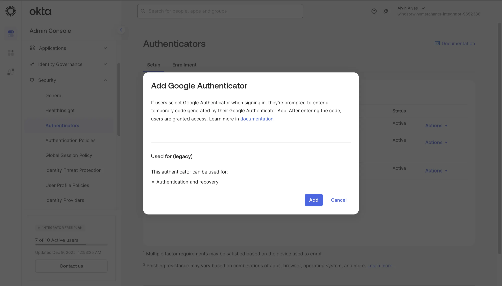
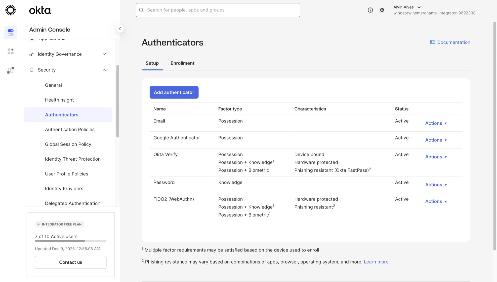
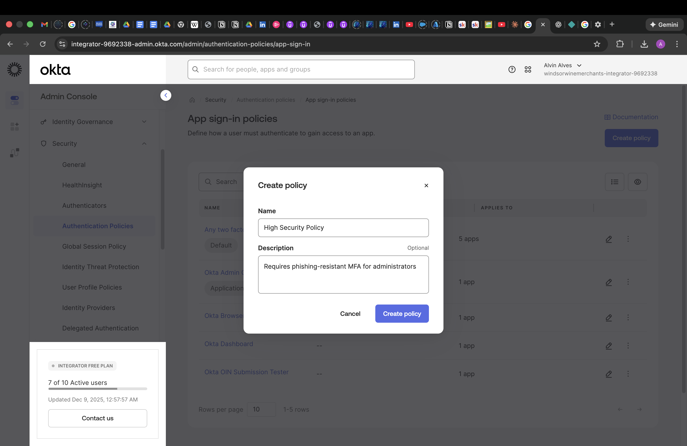
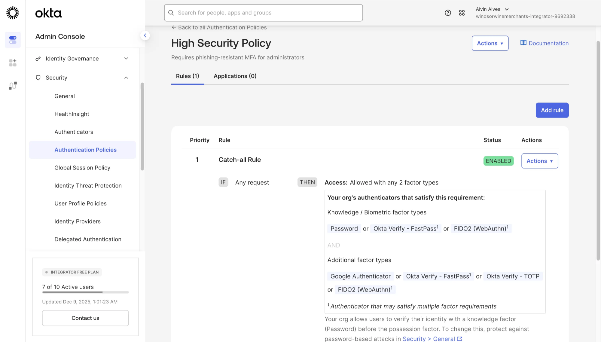
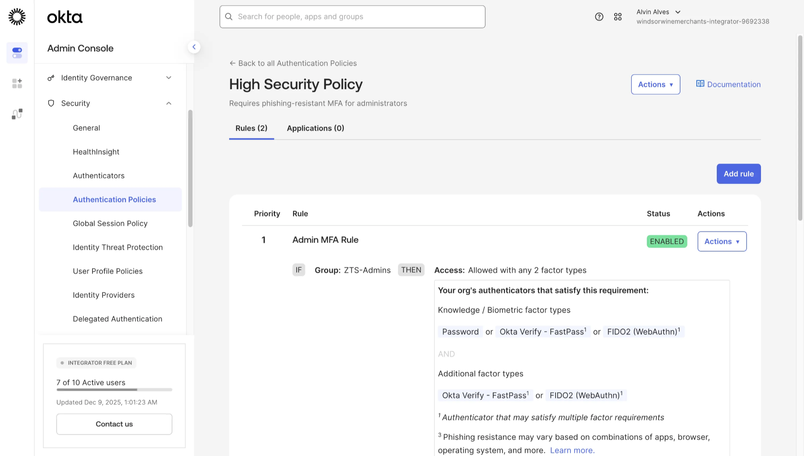

# Part 3 — Multi-Factor Authentication

**Phishing-Resistant MFA for Zero Trust Security**

Configure multiple authenticator factors and create adaptive authentication policies that enforce phishing-resistant MFA for privileged administrators while maintaining usability for standard users.

---

## Objective

Implement a comprehensive multi-factor authentication strategy by configuring multiple authenticator types across different factor categories, then create targeted authentication policies that enforce stronger security requirements for administrative access based on group membership.

---

## Technologies Used

| Component | Purpose |
|-----------|---------|
| **Okta Authenticators** | Factor enrollment and verification configuration |
| **Google Authenticator** | TOTP-based possession factor |
| **Okta Verify** | Push notifications with FastPass phishing resistance |
| **FIDO2 (WebAuthn)** | Hardware-protected passwordless authentication |
| **Authentication Policies** | Risk-based access control rules |

---

## Configuration Steps

### 3.1: Understanding Factor Types

Before configuring authenticators, it's important to understand the three factor categories used in modern MFA:

| Factor Type | Description | Examples in Okta |
|-------------|-------------|------------------|
| **Knowledge** | Something you know | Password |
| **Possession** | Something you have | Google Authenticator, Okta Verify, Email, FIDO2 key |
| **Biometric** | Something you are | Okta Verify with biometrics, FIDO2 with fingerprint |

Strong MFA requires factors from **two different categories**, not just two factors from the same category.

---

### 3.2: Adding Google Authenticator

Expand the available possession factors by adding Google Authenticator to your organization's authenticator catalog.

Navigate to **Security → Authenticators** and click **Add authenticator**.

**Configuration Details:**
- **Factor Type:** Possession (TOTP-based)
- **Usage:** Authentication and recovery
- **Compatibility:** Works with any TOTP-compatible app (Google Authenticator, Authy, Microsoft Authenticator)

> 💡 **Key Takeaway:** Google Authenticator provides a widely-compatible backup option for users who cannot use Okta Verify, ensuring MFA accessibility while maintaining security.

---

### 3.3: Reviewing Configured Authenticators

After adding Google Authenticator, review the complete authenticator catalog to understand available factors.

Navigate to **Security → Authenticators** to view all configured factors:

**Authenticator Inventory:**

| Authenticator | Factor Type | Characteristics | Status |
|---------------|-------------|-----------------|--------|
| **Email** | Possession | One-time codes via email | Active |
| **Google Authenticator** | Possession | TOTP codes (6-digit, 30-second) | Active |
| **Okta Verify** | Possession + Knowledge/Biometric | Push, TOTP, FastPass (phishing-resistant) | Active |
| **Password** | Knowledge | Traditional password factor | Active |
| **FIDO2 (WebAuthn)** | Possession + Knowledge/Biometric | Hardware-protected, phishing-resistant | Active |

> 💡 **Key Takeaway:** A comprehensive authenticator catalog provides flexibility for different user populations while enabling security teams to mandate stronger factors for privileged access through authentication policies.

---

### 3.4: Creating a High Security Authentication Policy

Create a dedicated authentication policy for sensitive applications that require phishing-resistant MFA.

Navigate to **Security → Authentication Policies** and click **Create policy**.

**Policy Configuration:**
- **Name:** High Security Policy
- **Description:** Requires phishing-resistant MFA for administrators
- **Purpose:** Enforce elevated security for privileged access to sensitive applications

> 💡 **Key Takeaway:** Named policies with clear descriptions enable security teams to implement differentiated authentication requirements based on application sensitivity and user risk profiles.

---

### 3.5: Understanding the Catch-all Rule

Every authentication policy includes a default catch-all rule that applies to all users not matched by more specific rules.

Review the default rule configuration in the newly created policy:

**Catch-all Rule Analysis:**

| Component | Configuration |
|-----------|---------------|
| **Condition** | Any request (IF: Any request) |
| **Access** | Allowed with any 2 factor types |
| **Knowledge/Biometric Factors** | Password, Okta Verify - FastPass, FIDO2 |
| **Additional Factors** | Google Authenticator, Okta Verify - FastPass, Okta Verify - TOTP, FIDO2 |

The catch-all rule provides baseline security while allowing more specific rules to override it for targeted user groups.

---

### 3.6: Creating an Admin MFA Rule

Create a specific rule targeting administrators that requires phishing-resistant authenticators only.

Click **Add rule** and configure a rule targeting the ZTS-Admins group:

**Admin MFA Rule Configuration:**

| Component | Configuration |
|-----------|---------------|
| **Rule Name** | Admin MFA Rule |
| **Priority** | 1 (evaluated before catch-all) |
| **Condition** | IF Group: ZTS-Admins |
| **Access** | Allowed with any 2 factor types |
| **Knowledge/Biometric Factors** | Password, Okta Verify - FastPass, FIDO2 (WebAuthn) |
| **Additional Factors** | Okta Verify - FastPass, FIDO2 (WebAuthn) **only** |
| **Status** | ENABLED |

**Critical Security Enhancement:**

The Additional factor types for administrators are limited to:
- **Okta Verify - FastPass** — Phishing-resistant push authentication
- **FIDO2 (WebAuthn)** — Hardware-protected security keys

Standard factors like Google Authenticator and Okta Verify TOTP are **excluded** from the admin rule, ensuring administrators must use phishing-resistant methods that cannot be compromised through social engineering or man-in-the-middle attacks.

> 💡 **Key Takeaway:** Group-based authentication rules enable Zero Trust principles by enforcing the strongest security requirements for users with elevated privileges, while maintaining a balance between security and usability for standard users.

---

## Enterprise Relevance

**Security & Compliance Benefits:**

| Benefit | Implementation |
|---------|----------------|
| **Zero Trust Architecture** | Verify every access request with strong MFA |
| **Phishing Resistance** | FIDO2 and FastPass protect against credential theft |
| **Privileged Access Management** | Elevated requirements for administrator accounts |
| **Defense in Depth** | Multiple factor types provide authentication redundancy |
| **Regulatory Compliance** | Meets NIST 800-63B AAL2/AAL3 requirements |

**Key Skills Demonstrated:**
- Authenticator factor type classification (Knowledge, Possession, Biometric)
- Authentication policy creation and rule prioritization
- Group-based conditional access configuration
- Phishing-resistant MFA implementation
- Zero Trust security principles for privileged access

---

← [Part 2: Application Integration & SSO](part-2-application-integration-sso.md) | [Back to Lab Overview](../README.md) | [Part 4: Lifecycle Management →](part-4-lifecycle-management.md)
