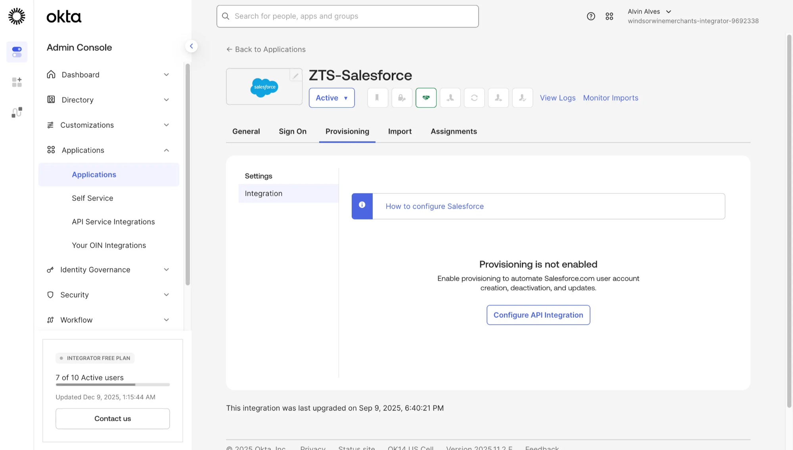

# Part 4 — Lifecycle Management

**Automated User Provisioning and Deprovisioning**

Explore Okta's lifecycle management capabilities that automate user account creation, updates, and deactivation across integrated applications through SCIM-based provisioning.

---

## Objective

Understand how Okta's lifecycle management enables automated provisioning workflows that synchronize user accounts between the Universal Directory and downstream applications, eliminating manual account management and ensuring timely access changes.

---

## Technologies Used

| Component | Purpose |
|-----------|---------|
| **Okta Provisioning** | Automated user lifecycle synchronization |
| **SCIM 2.0** | System for Cross-domain Identity Management protocol |
| **API Integration** | Secure connection to application provisioning endpoints |
| **Attribute Mapping** | Profile field synchronization between Okta and apps |

---

## Configuration Steps

### 4.1: Understanding Lifecycle Management

Lifecycle management automates the entire user journey across connected applications:

| Lifecycle Event | Manual Process | Automated with Okta |
|-----------------|----------------|---------------------|
| **Joiner** | IT creates accounts in each app individually | User created in Okta → accounts auto-provisioned |
| **Mover** | IT updates roles/attributes in each app | Attribute change in Okta → synced everywhere |
| **Leaver** | IT disables/deletes accounts one by one | User deactivated in Okta → all app accounts disabled |

**Business Impact:**
- Reduces onboarding time from days to minutes
- Eliminates orphaned accounts (security risk)
- Ensures compliance with access certification requirements
- Frees IT staff from repetitive manual tasks

---

### 4.2: Accessing Provisioning Configuration

Navigate to the application's Provisioning tab to configure automated lifecycle management.

Go to **Applications → Applications → ZTS-Salesforce → Provisioning**:



**Provisioning Interface Components:**

| Element | Description |
|---------|-------------|
| **Settings** | General provisioning configuration |
| **Integration** | API connection to the target application |
| **Configure API Integration** | Initiates OAuth/API credential setup with Salesforce |

> 💡 **Key Takeaway:** The OIN catalog pre-configures the SCIM endpoints and attribute mappings for Salesforce, but API integration requires administrator credentials to establish the secure connection.

---

### 4.3: Provisioning Capabilities (Conceptual)

When API integration is configured, Okta enables the following provisioning features:

**Provisioning to App (Outbound):**

| Feature | Description |
|---------|-------------|
| **Create Users** | Automatically create Salesforce accounts when users are assigned |
| **Update User Attributes** | Sync profile changes (name, department, title) to Salesforce |
| **Deactivate Users** | Disable Salesforce accounts when users are unassigned or deactivated |

**Provisioning from App (Inbound):**

| Feature | Description |
|---------|-------------|
| **Import Users** | Discover existing Salesforce users and link to Okta profiles |
| **Import Groups** | Sync Salesforce roles/profiles as Okta groups |

---

### 4.4: Attribute Mapping Overview

Provisioning relies on attribute mapping to synchronize user profile data:

```
┌─────────────────────────────────────────────────────────────┐
│                    ATTRIBUTE MAPPING                        │
├─────────────────────────────────────────────────────────────┤
│                                                             │
│   Okta Universal Directory    →    Salesforce               │
│   ─────────────────────────────────────────────────         │
│   user.firstName              →    FirstName                │
│   user.lastName               →    LastName                 │
│   user.email                  →    Email                    │
│   user.department             →    Department               │
│   user.title                  →    Title                    │
│   user.userType               →    ProfileId (mapped)       │
│                                                             │
└─────────────────────────────────────────────────────────────┘
```

Custom attributes created in Part 1 (like `userType` and `Department`) can be mapped to corresponding Salesforce fields for consistent profile data across systems.

---

### 4.5: SCIM Protocol Architecture

Okta uses SCIM 2.0 (System for Cross-domain Identity Management) for provisioning:

```
┌──────────────┐         SCIM 2.0 API         ┌──────────────┐
│              │  ────────────────────────►   │              │
│    OKTA      │    POST /Users (Create)      │  SALESFORCE  │
│   (IdP)      │    PATCH /Users (Update)     │    (SP)      │
│              │    DELETE /Users (Deactivate)│              │
│              │  ◄────────────────────────   │              │
│              │    GET /Users (Import)       │              │
└──────────────┘                              └──────────────┘
```

**SCIM Benefits:**
- Standardized protocol supported by major SaaS applications
- Real-time synchronization (vs. batch updates)
- Reduces custom integration development
- Enables consistent lifecycle management across all apps

---

## Enterprise Relevance

**Operational Benefits:**

| Benefit | Impact |
|---------|--------|
| **Reduced Onboarding Time** | New employees productive on day one |
| **Immediate Offboarding** | Access revoked within minutes of termination |
| **Audit Compliance** | Complete provisioning logs for SOX, HIPAA, SOC 2 |
| **Reduced IT Burden** | Eliminates manual account management tickets |
| **Data Consistency** | Profile attributes synchronized across all systems |

**Key Skills Demonstrated:**
- Understanding of SCIM 2.0 provisioning protocol
- Joiner/Mover/Leaver lifecycle automation concepts
- Attribute mapping between identity provider and applications
- Integration of provisioning with SSO and MFA configurations

---

← [Part 3: Multi-Factor Authentication](part-3-multi-factor-authentication.md) | [Back to Lab Overview](../README.md) | [Part 5: Okta Workflows →](part-5-okta-workflows.md)
