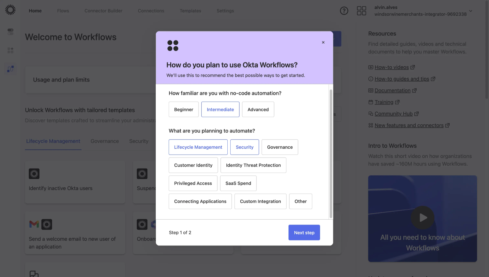
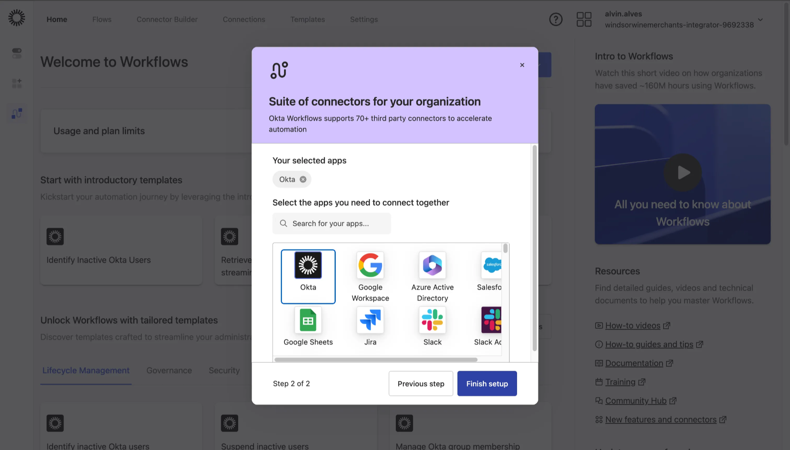
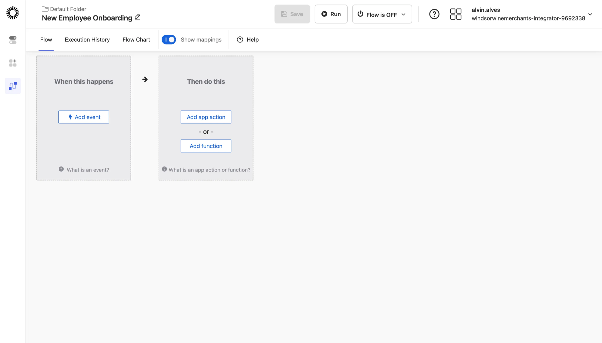
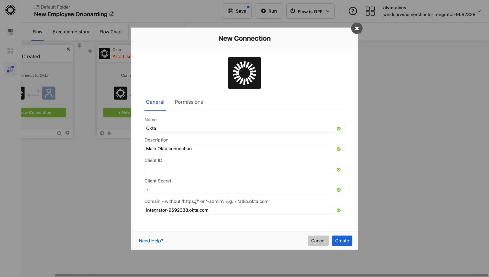
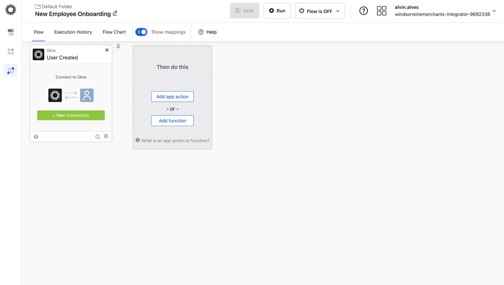

# Part 5 — Okta Workflows

**No-Code Identity Automation and Orchestration**

Build automated identity workflows using Okta's visual flow builder, connecting identity events to actions across 70+ third-party applications without writing code.

---

## Objective

Create automated workflows that respond to identity lifecycle events (like user creation) and orchestrate actions across connected applications, demonstrating the power of no-code automation for identity operations.

---

## Technologies Used

| Component | Purpose |
|-----------|---------|
| **Okta Workflows** | Visual no-code automation platform |
| **Flow Builder** | Drag-and-drop workflow design interface |
| **Connectors** | Pre-built integrations with 70+ applications |
| **Events & Actions** | Trigger-based automation logic |
| **OAuth 2.0** | Secure API authentication for connectors |

---

## Configuration Steps

### 5.1: Accessing Okta Workflows

Navigate to the Okta Workflows console to begin building automated identity processes.

The onboarding wizard helps customize your experience based on skill level and automation goals:



**Onboarding Configuration:**

| Setting | Selection |
|---------|-----------|
| **Experience Level** | Intermediate |
| **Automation Goals** | Lifecycle Management, Security |

**Available Automation Categories:**

| Category | Use Cases |
|----------|-----------|
| **Lifecycle Management** | Onboarding, offboarding, role changes |
| **Security** | Threat response, access reviews, anomaly handling |
| **Governance** | Compliance workflows, certification campaigns |
| **Customer Identity** | B2C registration, profile management |
| **Identity Threat Protection** | Suspicious activity response |
| **Privileged Access** | Just-in-time access, approval workflows |

> 💡 **Key Takeaway:** Okta Workflows supports automation across the entire identity lifecycle, from employee onboarding to security incident response.

---

### 5.2: Exploring Available Connectors

Review the extensive connector library that enables Workflows to integrate with your existing technology stack.



**Connector Ecosystem:**

| Category | Example Connectors |
|----------|-------------------|
| **Identity Providers** | Okta, Azure AD, Google Workspace |
| **Business Apps** | Salesforce, ServiceNow, Workday |
| **Collaboration** | Slack, Microsoft Teams, Jira |
| **Productivity** | Google Sheets, Box, Dropbox |
| **Security** | CrowdStrike, Splunk, Palo Alto |

Okta Workflows supports **70+ pre-built connectors**, enabling identity automation to span across your entire enterprise application portfolio.

> 💡 **Key Takeaway:** The connector library eliminates custom API development, allowing identity teams to build sophisticated automations without engineering resources.

---

### 5.3: Creating a New Flow

Create a new workflow to automate the employee onboarding process triggered by user creation events.

Navigate to **Flows → New Flow** and name it "New Employee Onboarding":



**Flow Builder Components:**

| Component | Purpose |
|-----------|---------|
| **When this happens** | Event trigger that initiates the workflow |
| **Then do this** | Actions to execute when triggered |
| **Add event** | Configure the triggering condition |
| **Add app action** | Connect to external applications |
| **Add function** | Apply logic, transformations, or conditions |

**Flow Design Pattern:**

```
┌─────────────────┐         ┌─────────────────┐
│  TRIGGER        │         │  ACTION(S)      │
│  ─────────────  │   →     │  ─────────────  │
│  When this      │         │  Then do this   │
│  happens...     │         │  ...            │
└─────────────────┘         └─────────────────┘
```

---

### 5.4: Configuring the Okta Connection

Establish a secure API connection to Okta using OAuth 2.0 credentials for workflow automation.

Click **+ New Connection** and configure the Okta connector:



**Connection Configuration:**

| Field | Value |
|-------|-------|
| **Name** | Okta |
| **Description** | Main Okta connection |
| **Client ID** | (OAuth application client ID) |
| **Client Secret** | (OAuth application secret) |
| **Domain** | integrator-9692338.okta.com |

**Security Considerations:**
- Client credentials are stored securely by Okta Workflows
- Connections can be scoped with specific API permissions
- Multiple connections can be created for different use cases

> 💡 **Key Takeaway:** The OAuth-based connection model ensures secure, auditable API access while enabling reusable connections across multiple workflows.

---

### 5.5: Configuring the User Created Trigger

Set up the workflow to automatically execute when a new user is created in Okta Universal Directory.

Select **Okta → User Created** as the triggering event:



**Trigger Configuration:**

| Component | Configuration |
|-----------|---------------|
| **Event Source** | Okta |
| **Event Type** | User Created |
| **Connection** | Main Okta connection |
| **Status** | Connected (ready for actions) |

**Available User Created Event Data:**

| Field | Description |
|-------|-------------|
| `user.id` | Unique Okta user identifier |
| `user.profile.firstName` | User's first name |
| `user.profile.lastName` | User's last name |
| `user.profile.email` | User's email address |
| `user.profile.department` | Department attribute |
| `user.profile.userType` | Custom user type attribute |

These event fields can be passed to subsequent actions, enabling dynamic, user-specific automation.

---

### 5.6: Workflow Use Case Examples

With the User Created trigger configured, here are common actions that could be added to complete an onboarding workflow:

| Action | Connector | Purpose |
|--------|-----------|---------|
| **Send Welcome Email** | Gmail / Office 365 | Notify new employee with onboarding info |
| **Create Slack Channel** | Slack | Set up dedicated onboarding channel |
| **Assign to Group** | Okta | Add user to department-based groups |
| **Create Jira Ticket** | Jira | Generate IT onboarding task |
| **Provision Google Workspace** | Google | Create email and Drive account |
| **Notify Manager** | Slack / Teams | Alert manager of new team member |

---

## Enterprise Relevance

**Automation Benefits:**

| Benefit | Impact |
|---------|--------|
| **Reduced Manual Work** | Eliminates repetitive IT tasks |
| **Faster Onboarding** | New employees productive immediately |
| **Consistent Processes** | Every user gets same onboarding experience |
| **Audit Trail** | Complete execution history for compliance |
| **Scalability** | Handle thousands of users without additional staff |

**Key Skills Demonstrated:**
- No-code workflow automation design
- Event-driven architecture understanding
- OAuth 2.0 API connection configuration
- Cross-application integration patterns
- Identity lifecycle automation concepts

---

← [Part 4: Lifecycle Management](part-4-lifecycle-management.md) | [Back to Lab Overview](../README.md) | [Part 6: API & Code Automation →](part-6-api-automation.md)
