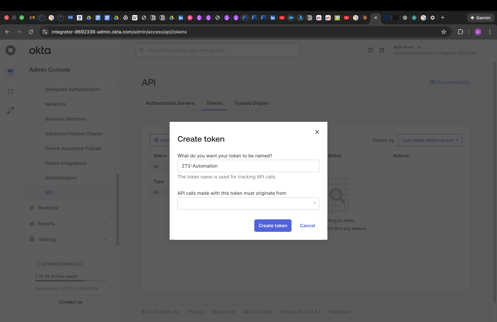
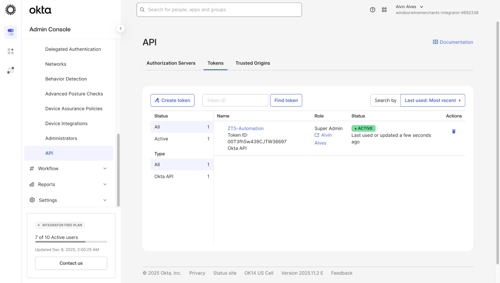
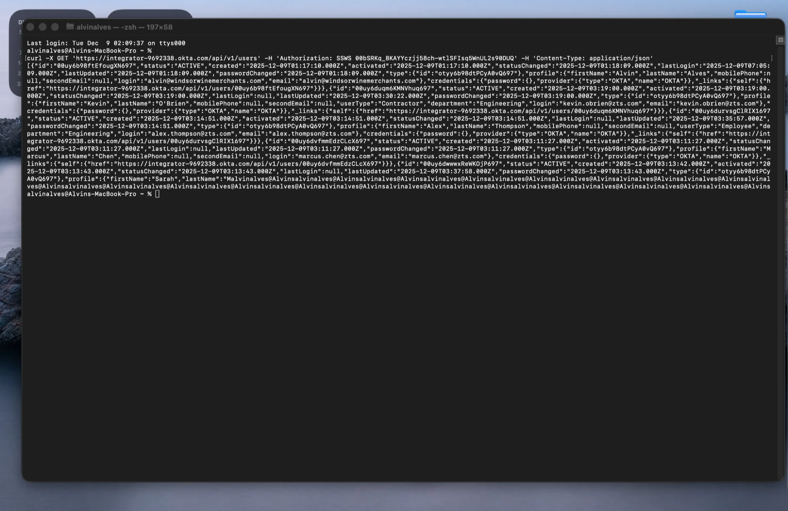
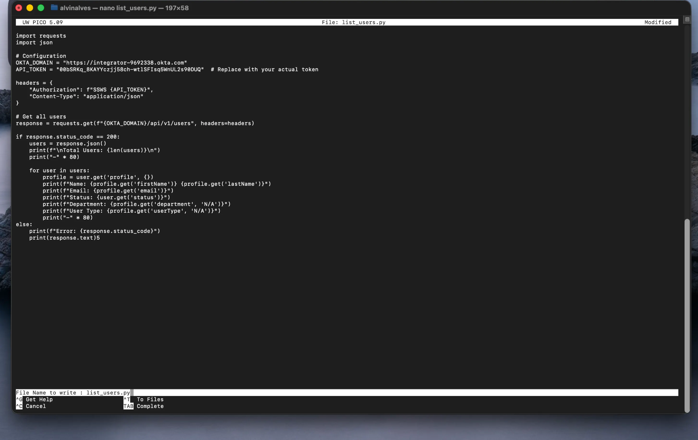
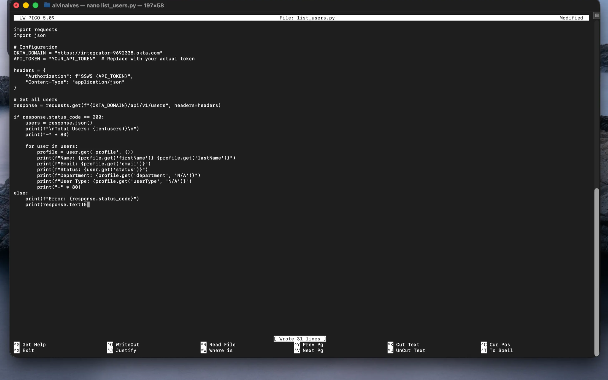
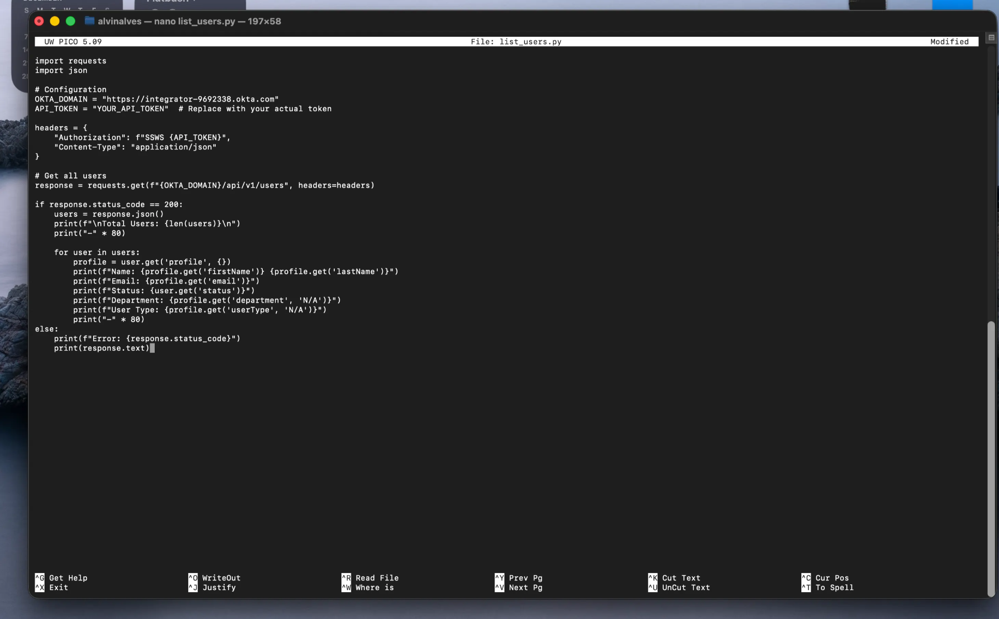
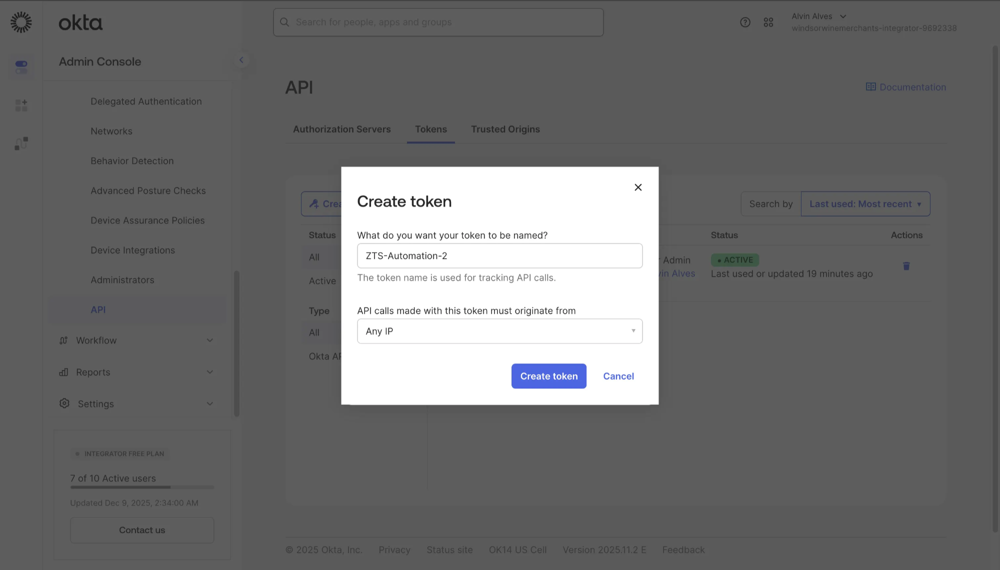
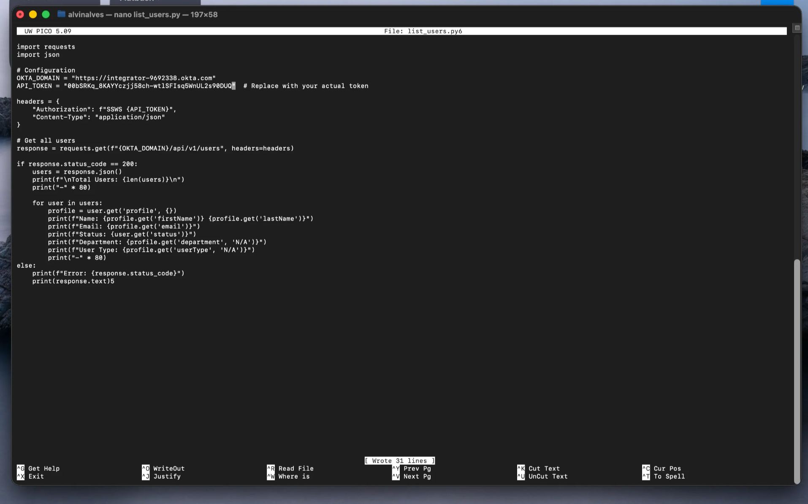
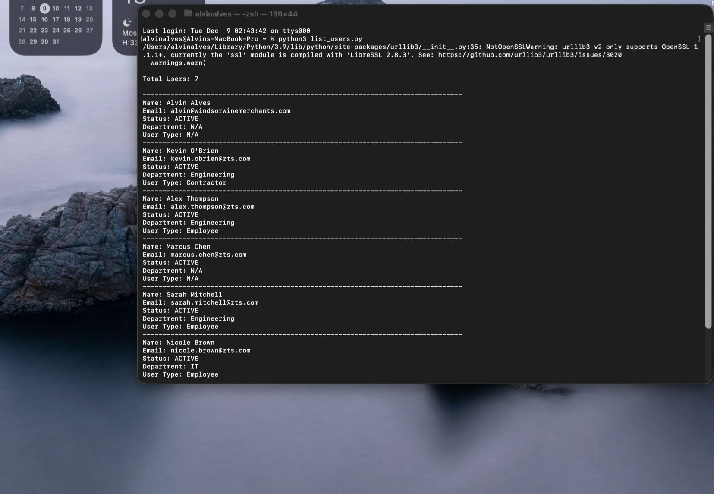
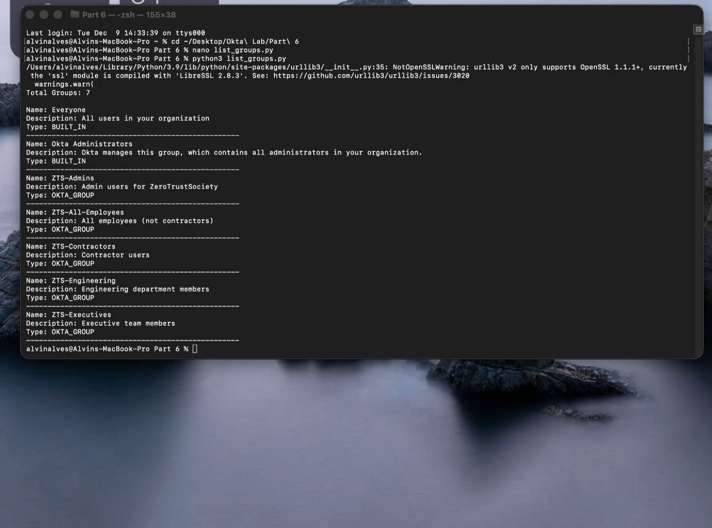

# Part 6 — API & Code Automation

**Programmatic Identity Management with Okta APIs**

Create API tokens and develop Python scripts to automate identity operations, demonstrating programmatic access to users and groups through Okta's RESTful API.

---

## Objective

Establish secure API access to Okta and develop automation scripts that programmatically retrieve user and group data, demonstrating the foundation for building custom identity management tools and integrations.

---

## Technologies Used

| Component | Purpose |
|-----------|---------|
| **Okta Management API** | RESTful API for identity operations |
| **API Tokens (SSWS)** | Service account authentication |
| **Python 3** | Scripting language for automation |
| **Requests Library** | HTTP client for API calls |
| **cURL** | Command-line API testing |
| **JSON** | Data interchange format |

---

## Configuration Steps

### 6.1: Creating an API Token

Generate an API token for programmatic access to Okta's Management API.

Navigate to **Security → API → Tokens** and click **Create token**:



| Field | Value |
|-------|-------|
| **Token Name** | ZTS-Automation |
| **Purpose** | Automation scripts and API access |
| **IP Restriction** | (Optional) Limit to specific IPs |

> ⚠️ **Security Note:** API tokens inherit the permissions of the administrator who creates them. Store tokens securely and never commit them to version control.

---

### 6.2: Verifying Token Creation

Confirm the API token is active and review its properties.



| Property | Value |
|----------|-------|
| **Name** | ZTS-Automation |
| **Token ID** | 00T3fh5w439CJTW36697 |
| **Type** | Okta API |
| **Role** | Super Admin |
| **Status** | ACTIVE |
| **Owner** | Alvin Alves |

The token is now ready for use in API calls with the `SSWS` authorization scheme.

---

### 6.3: Testing API Access with cURL

Validate API connectivity using a command-line cURL request to retrieve all users.

```bash
curl -X GET 'https://integrator-9692338.okta.com/api/v1/users' \
  -H 'Authorization: SSWS YOUR_API_TOKEN' \
  -H 'Content-Type: application/json'
```



**API Response Structure:**

The API returns a JSON array of user objects, each containing:
- `id` — Unique Okta user identifier
- `status` — User lifecycle state (ACTIVE, STAGED, etc.)
- `profile` — User attributes (firstName, lastName, email, department, userType)
- `credentials` — Authentication configuration
- `_links` — HATEOAS navigation links

> 💡 **Key Takeaway:** The cURL test confirms API connectivity and token validity before developing more complex automation scripts.

---

### 6.4: Developing the User Listing Script

Create a Python script to retrieve and display all users from the Okta Universal Directory.

Create a new file `list_users.py`:



**Script Structure:**

```python
import requests
import json

# Configuration
OKTA_DOMAIN = "https://integrator-9692338.okta.com"
API_TOKEN = "YOUR_API_TOKEN"  # Replace with your actual token

headers = {
    "Authorization": f"SSWS {API_TOKEN}",
    "Content-Type": "application/json"
}

# Get all users
response = requests.get(f"{OKTA_DOMAIN}/api/v1/users", headers=headers)

if response.status_code == 200:
    users = response.json()
    print(f"\nTotal Users: {len(users)}\n")
    print("-" * 80)

    for user in users:
        profile = user.get('profile', {})
        print(f"Name: {profile.get('firstName')} {profile.get('lastName')}")
        print(f"Email: {profile.get('email')}")
        print(f"Status: {user.get('status')}")
        print(f"Department: {profile.get('department', 'N/A')}")
        print(f"User Type: {profile.get('userType', 'N/A')}")
        print("-" * 80)
else:
    print(f"Error: {response.status_code}")
    print(response.text)
```

> 📁 The complete script is available at [`scripts/list_users.py`](../scripts/list_users.py).

---

### 6.5: Saving the Script

Save the Python script for execution.



---

### 6.6: Configuring API Token in Script

Update the script with the actual API token for authentication.



> 🔒 **Security Best Practice:** In production environments, store API tokens in environment variables or a secrets manager, never hardcoded in scripts. Use `os.environ.get('OKTA_API_TOKEN')` instead of embedding the token directly.

---

### 6.7: Creating Additional API Tokens

Create a second token for different automation purposes or to demonstrate token rotation.



**Token Comparison:**

| Token | Purpose | IP Restriction |
|-------|---------|----------------|
| ZTS-Automation | Initial testing | Default |
| ZTS-Automation-2 | Production scripts | Any IP |

---

### 6.8: Updating Script with New Token

Configure the script to use the newly created token.



---

### 6.9: Executing the User Listing Script

Run the Python script to retrieve and display all users from Okta.

```bash
python3 list_users.py
```



**Script Output — Users Retrieved:**

| Name | Email | Department | User Type |
|------|-------|------------|-----------|
| Alvin Alves | alvin@windsorwinemerchants.com | N/A | N/A |
| Kevin O'Brien | kevin.obrien@zts.com | Engineering | Contractor |
| Alex Thompson | alex.thompson@zts.com | Engineering | Employee |
| Marcus Chen | marcus.chen@zts.com | N/A | N/A |
| Sarah Mitchell | sarah.mitchell@zts.com | Engineering | Employee |
| Nicole Brown | nicole.brown@zts.com | IT | Employee |

The script successfully retrieves all 7 users created in Part 1, including the custom attributes (Department, User Type) configured in the Universal Directory.

---

### 6.10: Executing the Group Listing Script

Run a second script to retrieve and display all groups from Okta.

```bash
python3 list_groups.py
```



**Script Output — Groups Retrieved:**

| Group Name | Description | Type |
|------------|-------------|------|
| Everyone | All users in your organization | BUILT_IN |
| Okta Administrators | All administrators in your organization | BUILT_IN |
| ZTS-Admins | Admin users for ZeroTrustSociety | OKTA_GROUP |
| ZTS-All-Employees | All employees (not contractors) | OKTA_GROUP |
| ZTS-Contractors | Contractor users | OKTA_GROUP |
| ZTS-Engineering | Engineering department members | OKTA_GROUP |
| ZTS-Executives | Executive team members | OKTA_GROUP |

The groups script confirms all 7 groups (2 built-in + 5 custom) are accessible via the API, including the groups created with automated rules in Part 1.

> 📁 The complete script is available at [`scripts/list_groups.py`](../scripts/list_groups.py).

---

## Complete Script Reference

Both Python scripts are available in the [`scripts/`](../scripts/) directory:

- [**list_users.py**](../scripts/list_users.py) — Retrieve and display all users with profile attributes
- [**list_groups.py**](../scripts/list_groups.py) — Retrieve and display all groups with descriptions and types

---

## Enterprise Relevance

**Automation Capabilities Demonstrated:**

| Capability | Business Value |
|------------|----------------|
| **User Enumeration** | Audit and compliance reporting |
| **Group Retrieval** | Access review automation |
| **Attribute Access** | HR system synchronization |
| **Bulk Operations** | Mass user provisioning/deprovisioning |
| **Custom Integrations** | Connect Okta to internal tools |

**Key Skills Demonstrated:**
- Okta Management API authentication (SSWS tokens)
- RESTful API consumption with Python
- JSON parsing and data extraction
- Secure credential handling
- Command-line API testing with cURL
- Script development for identity automation

---

## Lab Complete 🎉

This concludes the Okta Identity Lab series. Across six parts, this lab demonstrated:

1. **Universal Directory** — Custom attributes, users, groups, automated rules
2. **Application Integration & SSO** — SAML federation and OIDC apps
3. **Multi-Factor Authentication** — Phishing-resistant MFA policies
4. **Lifecycle Management** — SCIM-based provisioning concepts
5. **Okta Workflows** — No-code automation orchestration
6. **API & Code Automation** — Programmatic identity management

---

← [Part 5: Okta Workflows](part-5-okta-workflows.md) | [Back to Lab Overview](../README.md)
